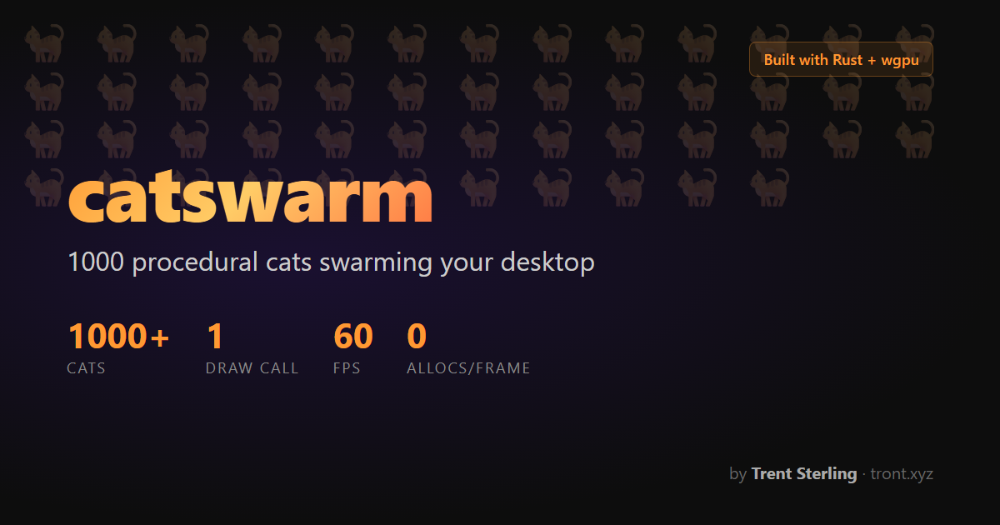
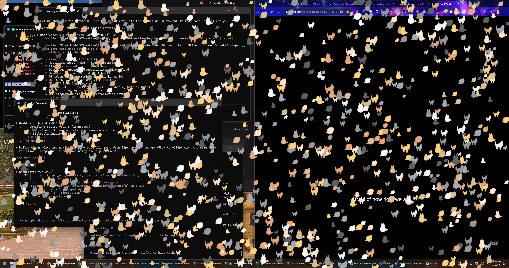

# catswarm



1000 procedural cats swarming your desktop. Transparent GPU-accelerated overlay for Windows.

Built in Rust with wgpu. Zero allocations in the hot path. Single draw call for all cats.

**[Landing Page](https://tront.xyz/catswarm/)** | **[Blog Post](https://blog.tront.xyz/posts/catswarm/)**



## Features

- **Transparent overlay** -- cats render on top of everything, fully click-through
- **1000+ cats** at 60 FPS via ECS architecture with spatial hashing
- **Single instanced draw call** -- all cats rendered in one GPU pass
- **Procedural SDF silhouettes** -- 3 poses (sitting, walking, sleeping) via signed distance fields
- **Mouse chasing** -- cats notice and chase your cursor
- **Cat-to-cat interactions** -- playing, chasing/fleeing, nap clusters, personal space
- **Behavior state machines** -- idle, walk, run, sleep, groom, chase with personality-weighted transitions
- **Unique personalities** -- each cat has laziness, energy, curiosity, and skittishness traits
- **Procedural generation** -- unique color, size, and personality per cat

## Planned

- Window awareness (cats walk on title bars, sit on taskbar)
- Enhanced personality system affecting behavior weights
- Better procedural visuals and animation frames
- System tray with settings

## Requirements

- Windows 10/11
- GPU with DX12 support
- Rust toolchain (1.75+)

## Build & Run

```bash
cargo run --release
```

Press **ESC** to quit.

## Tech Stack

| Layer | Tech |
|-------|------|
| Language | Rust (edition 2021) |
| Rendering | wgpu 27 (DX12 + DirectComposition) |
| Windowing | winit 0.30 + Win32 extensions |
| ECS | hecs 0.10 |
| Math | glam 0.29 (SIMD) |
| Spatial | Custom hash grid (128px cells) |

## How It Works

The overlay is a borderless always-on-top window with `WS_EX_TOOLWINDOW` style, rendered via DirectComposition for per-pixel alpha transparency. Each frame clears to `(0,0,0,0)` and draws all cats with premultiplied alpha blending.

Simulation runs at a fixed 60Hz timestep. A spatial hash grid enables O(1) neighbor queries for cat-to-cat interactions. The interaction system uses a two-phase read-then-write pattern with a snapshot cache to avoid ECS borrow conflicts while keeping all neighbor lookups as pure array indexing.

## Author

**Trent Sterling** ([@tront](https://tront.xyz)) -- game developer, VR creator, vibecoder

- [tront.xyz](https://tront.xyz)
- [GitHub](https://github.com/TrentSterling)
- [Bluesky](https://bsky.app/profile/tront.xyz)
- [Discord](https://discord.gg/0hyoWZyM6y7kkFCN)

## License

MIT
